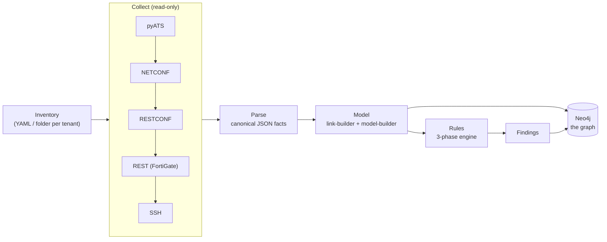
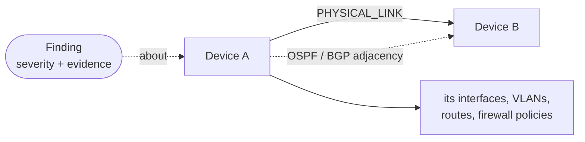
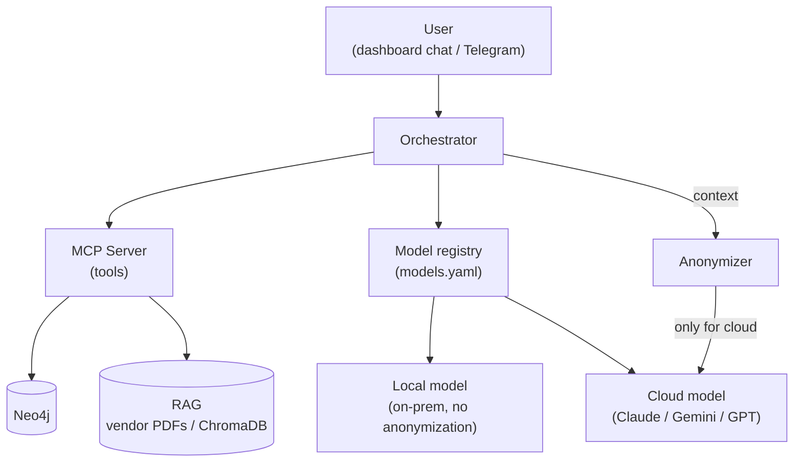
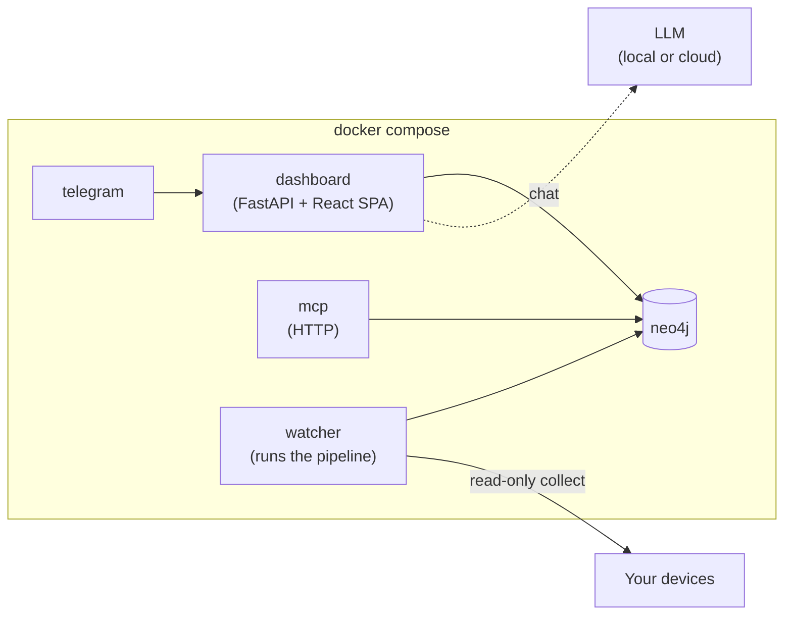

# Architecture

> **New here?** Start with the one-glance **[system overview](overview.md)**.
> This page is the detailed, per-layer view.

NetCopilot is **Network Context Intelligence**: it builds a *deterministic,
verifiable* model of a multi-vendor network from read-only collection, stores it
as a graph, and exposes it over **MCP** so any consumer — a human in the
dashboard, an LLM, a chat bot, or another agent — can ask grounded, traceable
questions about it.

Three ideas shape everything below:

- **Evidence over inference.** Every node, link, and finding is derived from
  collected device output, not guessed. The model is reproducible: the same
  inputs always produce the same graph.
- **One model, many consumers.** The pipeline produces a single graph; the
  dashboard, the chat, RAG, and Telegram are all just *readers* of it over
  one MCP surface.
- **Multitenant by design.** One deployment manages many networks at once. Each
  is a self-contained tenant — its **own inventory** and its **own credentials**
  (`inventory/<tenant>/lab.yaml` + `credentials.env`) — and every node in the
  graph is tagged with its `site` (the tenant) and `run_id`. Tenants are isolated
  **end to end**: separate credentials in, separate data out, a query for one
  never sees another.

---

## 1. The pipeline — from devices to a graph

Collection is read-only and runs a strategy chain per device, falling back until
one succeeds. Each stage writes a stable, inspectable artifact, so any run can be
replayed or audited.

| Stage | What it does |
|---|---|
| **Inventory** | Devices to collect (`name`, `mgmt_ip`, `os`, `role`, `site`). One YAML for a single network, or a self-contained folder per tenant (`lab.yaml` + `credentials.env`). |
| **Collect** | Per device, tries `pyATS → NETCONF → RESTCONF → REST → SSH` until one works. Cisco over the SSH/NETCONF stack; FortiGate over its REST API. Strictly read-only — NetCopilot never changes a device. |
| **Parse** | Normalizes raw output into canonical JSON facts, so the layers above don't care which protocol or vendor produced them. |
| **Model** | The link-builder turns per-device facts into a typed, **evidence-backed** topology (see [link-builder.md](link-builder.md)); the model-builder assembles devices, interfaces, VLANs, routing, and shared services. |
| **Rules** | A 3-phase engine (per-device → catalog → cross-device) evaluates the model and emits **Findings** with severities and evidence. |
| **Load** | The model + findings are written to Neo4j as one run, isolated by `site` + `run_id`. |

---

## 2. The graph — the source of truth

Everything downstream reads **one graph**, and it's a *literal* graph, not a pile
of tables: **devices are nodes, the cables and routing sessions between them are
relationships, and findings attach to whatever they're about.** Each collection
is a `Run`, and **every node carries a `site` + `run_id`** — this is what makes
NetCopilot **multitenant**: the `site` *is* the tenant, so many separate networks
live in the same graph fully isolated, and re-runs of a site keep a history you
can compare. Consumers scope every query to a site, so one tenant's data never
appears in another's answers.

**What's in it:**

- **Nodes** — `Run`, `Device`, `Interface`, `VLAN`, `Route` / `VRF`,
  `FirewallPolicy`, `Finding`, plus the shared services (subnets, OSPF areas,
  BGP ASNs) that tie devices together.
- **Relationships** — `PHYSICAL_LINK` (interface ↔ interface), `ROUTING_ADJACENCY`
  (device ↔ device, OSPF / BGP), the containment edges (a device *has* its
  interfaces, VLANs, routes…), and `about` (a finding points at the node it
  concerns).

The graph is the **contract**: tools query it with Cypher — never the live
devices. And because the model is deterministic and evidence-backed, every answer
traces back to the exact device output that produced it.

---

## 3. Consumers & the orchestrator — MCP at the center

The model is exposed as **MCP tools** (get topology, trace a path, list findings,
look up vendor docs, …). The dashboard and Telegram are MCP clients; an LLM turns
a natural-language question into the right tool calls and grounds its answer in
the results.

- **BYO model.** `models.yaml` lists local (vLLM/Ollama) and cloud (Claude /
  Gemini / any OpenAI-compatible) models; keys live in `.env` by name.
- **Privacy boundary.** Local models keep everything on-prem. For a cloud model,
  device names and addresses are run through the **anonymizer** before the request
  leaves the host.
- **RAG.** Vendor PDFs are embedded into ChromaDB; the orchestrator retrieves relevant
  passages to ground answers, alongside the graph.

---

## 4. Deployment — one image, a few services

Everything ships as one Docker image driven by `docker compose`. The dashboard
never collects directly: a **watcher** runs the pipeline wherever it can reach the
devices, decoupling the UI from collection dependencies.

| Service | Role |
|---|---|
| **neo4j** | The graph store. |
| **dashboard** | FastAPI backend + React SPA: topology, findings, reports, chat. Triggers runs via a flag file the watcher polls. |
| **mcp** | The MCP server over HTTP, for any external MCP client. |
| **telegram** | Optional bot; same chat, from your phone. |
| **watcher** | Executes collect → parse → model → rules → load when a run is requested. |

---

## 5. Design principles

- **Read-only on the network.** NetCopilot collects and reports; it never changes
  device configuration.
- **Deterministic & reproducible.** Same inputs → same graph; every finding traces
  back to evidence.
- **Multi-vendor, extensible.** Cisco (IOS-XE / IOS-XR) and Fortinet today; the
  strategy chain and parsers are built to add more.
- **Bring your own.** Model, inventory, RAG documents, Telegram bot, and SMTP are
  all yours, configured via `.env` + `models.yaml` — no code changes.
- **MCP-native.** One model, one tool surface; every consumer is a reader.
- **Multitenant.** Many networks in one deployment, each a self-contained tenant
  with its own credentials, isolated end to end by `site` + `run_id`.

---

## Where it's going

The open-source core above is the foundation: a deterministic, read-only model
served over MCP. The architecture is deliberately built so that **new context
sources, triggers, and consumers plug into the same seam (MCP + the graph)** —
not bolted on. The directions on the roadmap:

- **NetBox, both ways.** Read NetBox as the *intended* source of truth and
  reconcile it against the *actual* discovered state — or go the other way and
  **populate NetBox from what NetCopilot discovers**. Intended vs. actual, in one
  model.
- **Telemetry-driven runs.** Ingest streaming telemetry, and let **telemetry
  events trigger a fresh run** — so the model refreshes when the network changes,
  not only on a schedule.
- **Context enrichment.** Connect to the systems that already hold operational
  context — observability and assurance platforms (e.g. Splunk, ThousandEyes,
  Catalyst Center) — to **correlate logs and events** against the topology and
  enrich every answer.
- **Context for any agent.** Be the grounded, verifiable network-context source
  that **any external AI agent** can call — the source of truth in an agentic
  workflow.

The through-line: NetCopilot stays the **deterministic source of truth**; each of
these is just another reader or feeder of that same model. (These are
directional — the open-source core is what ships today.)

---

## Per-layer documents

- [The Link Builder](link-builder.md) — how per-device facts become a typed,
  evidence-backed topology (discovery methods, MAC fingerprinting, deduplication,
  classification).
