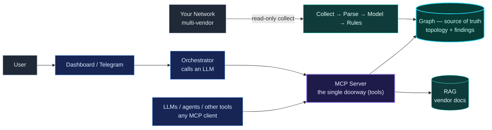

# NetCopilot — System Overview

NetCopilot is **Network Context Intelligence**: it collects a multi-vendor
network **read-only**, turns it into one deterministic, verifiable **graph** —
the source of truth — and serves that graph over **MCP** to humans, LLMs, and
agents.

## How to read it — three layers and one door

1. **Ingest (read-only, one-way).** `Collect → Parse → Model → Rules` reads your
   multi-vendor network and **never writes back to it**. The pipeline produces
   the topology model *and* the findings.
2. **The source of truth.** Everything lands in one **graph** — topology and
   findings together. Deterministic and reproducible: the same inputs always
   produce the same graph, and every answer traces back to evidence.
3. **The doorway.** The **MCP Server** is the single interface over the graph
   (plus a RAG store of vendor docs). Nothing reaches the model except through it.
4. **Consumers.** Anything that speaks MCP queries the source of truth — the
   built-in chat (Dashboard / Telegram) via an **Orchestrator** that calls an
   LLM, or any external **LLM, agent, or tool** as its own MCP client.

**Principles:** read-only on the network · deterministic & verifiable ·
multi-vendor · MCP-native · bring-your-own model.

> **Extensible by design.** MCP is the extension point — any new context source
> or consumer plugs into the same doorway, with no change to the core.

For the per-layer detail (pipeline, graph data model, orchestration, deployment),
see the [detailed architecture](README.md).
